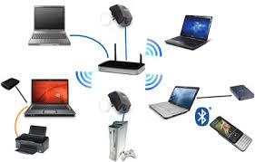

## KEAMANAN JARINGAN NIRKABEL

Sistem keamanan jaringan komputer adalah suatu sistem untuk mencegah dan mengidentifikasi penggunaan yang tidak sah dari jaringan komputer. Langkah-langkah pencegahan membantu menghentikan pengguna yang tidak sah yang disebut “penyusup” untuk mengakses setiap bagian dari sistem jaringan komputer . Tujuan /Keamanan jaringan komputer/ adalah untuk mengantisipasi resiko jaringan komputer berupa bentuk ancaman fisik maupun logik baik langsung ataupun tidak langsung mengganggu aktivitas yang sedang berlangsung dalam jaringan komputer.

## Pengertian Jaringan Nirkabel

Jaringan nirkabel (Inggris: wireless network) adalah bidang disiplin yang berkaitan dengan komunikasi antar sistem komputer tanpa menggunakan kabel.Jaringan nirkabel ini sering dipakai untuk jaringan komputer baik pada jarak yang dekat (beberapa meter,memakai alat/pemancar bluetooth) maupun pada jarak jauh (lewat satelit).Bidang ini erat hubungannya dengan bidang telekomunikasi, teknologi informasi, dan teknik komputer. Jenis jaringan yang populer dalam kategori jaringan nirkabel ini meliputi : Jaringan kawasan lokal nirkabel (wireless LAN/WLAN),dan Wi-Fi.Jaringan nirkabel biasanya menghubungkan satu sistem komputer dengan sistem yang lain dengan menggunakan beberapa macam media transmisi tanpa kabel, seperti: gelombang radio,gelombang mikro,maupun cahaya infra merah.

## * Manfaat Jaringan Nirkabel

a. Pengguna dapat saling berbagi file dan sumber daya lainnya dengan oerangkat lain yang terhubung ke jaringan tanpa harus bersuah payah melepas port.

b. Pengguna dapat bergerak bebas dalam menggunakan Laptop maupun perangkat genggap lainnya, karena mempunyai jangkauan are lebih luas tanpa kabel.

c. Lebih nyaman digunakan.

d. Jaringan nirkabel seringkali dapat menangani pengguna dalam jumlah yang lebih banyak karena tidak dibatasi oleh sejumlah port koneksi tertentu.

e. Pengalihan informasi secara instan ke media sosial menjadi lebih mudah. Misalnya, mengambil foto dan mengunggahnya ke Facebook pada umumnya bisa dilakukan lebih cepat        dengan teknologi nirkabel. 

## * Kekurangan Jaringan Nirkabel

a. Kecepatan transfer file atau sharing biasanya akan lebih lambar dibandingkan dengan jaringan berkabel.

b. Instalasi dan pengembanganya yang cukup mahal.

c. Peralatan yang masih tinggi harganya.

d. Kekuatan sinyal sangat tergantung kepada faktor cuaca.

e. Informasi yang kurang aman dan lebih mudah di hack.

## * Tujuan Dari Sistem Keamanan Jaringan Nirkabel

a. Dapat melindungi keamanan pada sistem informasi mengenai akses, pengungkapan, penggunaan, modifikasi, gangguan maupun penghancuran.

b. Dapat digunakan untuk mengamankan jaringan supaya terhindarkan dari yang namanya gangguan tanpa harus menghalangi para penggunanya.

c. Untuk melakukan antisipasi pada saat jaringan telah berhasil ditembus oleh pihak luar.

d. Memberikan sumber informasi sesuai yang dibutuhkan oleh para penggunanya apabila komputer berada dalam kondisi yang tidak aman, maka untuk tingkat availability nya dapat      dipertanyakan sehingga komputer bisa di shutdown apabila bisa dieksploitasi oleh pihak attacker.

e. Mampu menjaga rahasia yang terdapat pada komputer sehingga seluruh informasi rahasia tersebut tidak bisa jatuh pada tangan attacker.Sementara untuk berbagai cara dapat        dilakukan misalnya seperti penggunaan security mode, pembatasan akses dan cryptography.

f. Untuk memberikan informasi secara konsisten, sama dan juga utuh. Untuk data integrity dapat digunakan agar tidak terjadi penyisipan-penyisipan untuk informasi dari            beberapa pihak attacker yang ada pada komputer.

g. Untuk mengawasi informasi yang terdapat pada komputer sehingga penggunaannya bisa melakukan pengontrolan supaya bisa memonitoring dari seluruh aktivitas yang terdapat pada    komputer.

